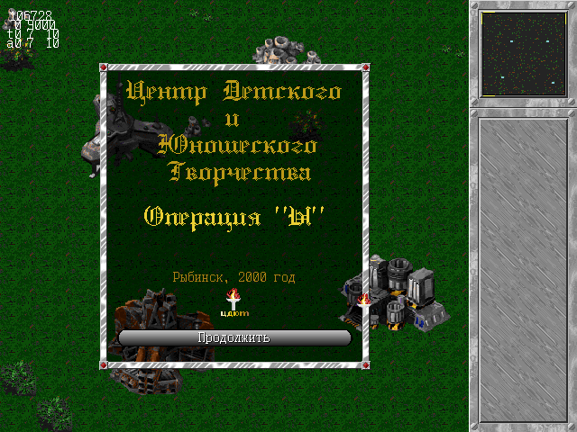
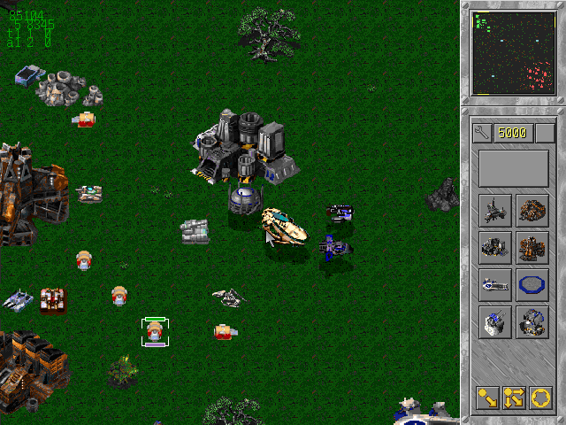
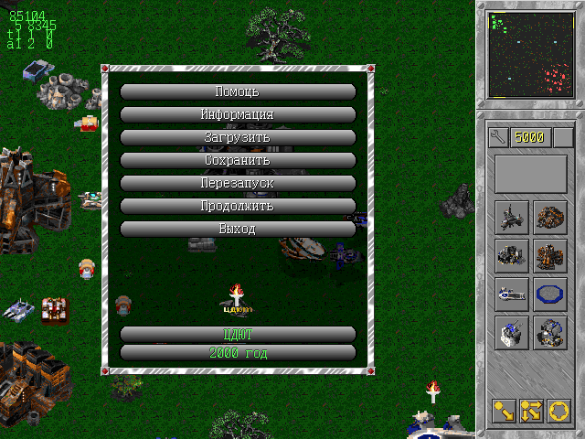
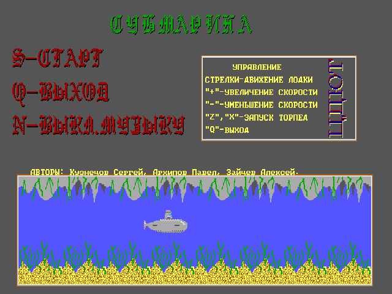
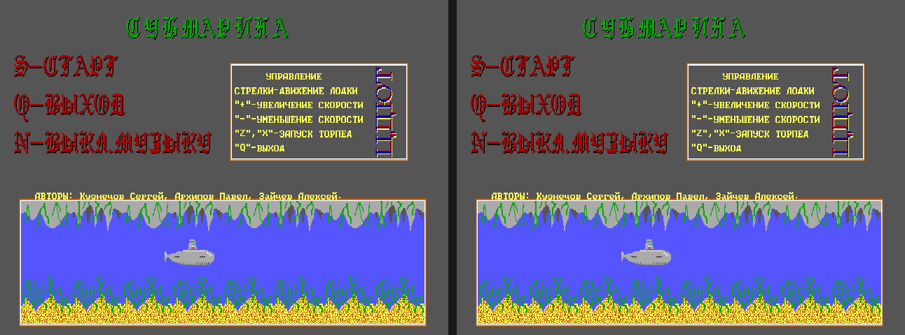

# ЦДЮТ: школьные игры на Turbo Pascal

Две DOS-игры, написанные в Центре детского и юношеского творчества (Рыбинск),
и их браузерные версии.

| Папка | Игра | Что это |
|---|---|---|
| [`work23/`](work23/) | «Операция Ы» | Стратегия реального времени: база, харвестеры, заводы, авиация, невидимки, хронотанки и компьютерный противник, который строит базу с нуля. Turbo Pascal 7, VESA 640×480×256, Sound Blaster. Автор — Павел Архипов. |
| [`subm/`](subm/) | «Субмарина» («Подводная лодка») | Аркада-лабиринт: подводная лодка, торпеды, кислород, ключ и выход, три уровня. Turbo Pascal 7, BGI, VGA 640×350×16. Авторы — Алексей Зайцев, Сергей Кузнецов, Павел Архипов; руководитель — Д. И. Аргов. |

В каждой папке:

* `sources/` — оригинальные файлы, как они лежали на диске: исходники на Паскале
  (в кодировке CP866), ресурсы, сохранения, собранный EXE;
* `web/` — перенос в браузер: программа, построчно переписанная на JavaScript,
  и эмуляция окружения DOS под ней.

## Как это выглядит

**«Операция Ы»** — стартовое окно, база с авиацией (сохранение SAVE2) и полупрозрачное меню поверх игры:

<p>



</p>

**«Субмарина»** — заставка и комната второго уровня с акулой, осьминогом и ключом
(640×350 растянуто до 4:3, как на мониторе):

<p>


</p>

## Запуск

Браузерная версия: открыть `web/index.html` или однофайловую версию —
`work23/web/Operaciya_Y.html`, `subm/web/Submarina.html`. Сервер и интернет не нужны.

Оригинал: запустить `WORK23.EXE` или `SUBM8.EXE` из `sources/` в DOSBox.

## Как сделаны браузерные версии

Задача была — слепок «как было», один в один. Код переписан построчно с сохранением имён,
под ним эмулируется то, на чём игры работали в DOS: видеорежимы и библиотеки графики,
шрифты, звук, клавиатура и мышь, память, файлы, ошибки времени выполнения. Результат сверен
с оригинальными EXE, запущенными в DOSBox: кадры совпадают попиксельно. Баги оригиналов
оставлены и помечены в коде комментарием `BUG (оригинал)`.



*Слева — оригинальный `SUBM8.EXE` в DOSBox, справа — браузерная версия: 0 отличающихся пикселей.
«Операция Ы» так же сверена с `WORK23.EXE`: меню, все 11 сохранений, игровые ходы, хронотанк.*

Подробности — в `web/README.md` каждой игры и на кнопке «Отчёт о переезде» внутри
самих игр. Браузерные версии сделал Claude (Anthropic) в октябре 2026 года.

## Пересборка

Готовым страницам ничего не нужно. После правок в `web/` (Python 3, без зависимостей):

```
python tools/build_assets.py    # ресурсы из ../sources в js/assets.js
python tools/build_doklad.py    # «Операция Ы»: доклад DOKLAD.TXT в index.html
python tools/build_help.py      # «Субмарина»: справка HELP.TXT в index.html
python tools/build_single.py    # однофайловая версия
```

## Сторонние файлы

В `sources/` вместе с кодом авторов лежат файлы, написанные не ими: модули и драйверы
Borland Turbo Pascal 7 (`*.TPU`, `EGAVGA.BGI`, шрифты `*.CHR`), графическая библиотека
VX (`VX.ASM` и связанные с ней файлы) и просмотрщик `SVIEW.EXE`. Они оставлены, чтобы
снимок был полным.
