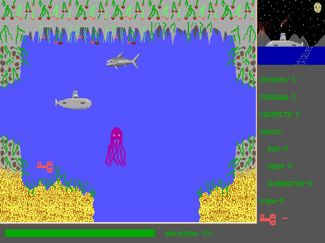

# «Субмарина» («Подводная лодка») — браузерная версия

Перенос DOS-игры SUBM8 (Turbo Pascal 7, модуль Graph, VGA 640×350×16) на JavaScript.
Авторы игры — Зайцев Алексей, Кузнецов Сергей, Архипов Павел (ЦДЮТ, Рыбинск).

Исходные файлы игры лежат рядом, в `../sources`, — как они были на диске. Готовым страницам они не нужны; из них скрипты `tools/build_*.py` пересобирают ресурсы.

## Запуск

Откройте `index.html` в браузере. Сервер не нужен: спрайты, уровни и шрифты встроены в
`js/assets.js`. Игра стартует сразу, как `SUBM8.EXE` из командной строки.

Управление как в оригинале: S — старт, стрелки — лодка, «+»/«−» — скорость, Z — торпеда
вперёд, X — торпеда вниз, Q — подорвать лодку, Esc — выход в DOS, N — выключить музыку
на заставке. Клавиатура ведёт себя как в DOS: буфер BIOS на 15 нажатий,
автоповтор AT (500 мс, затем 10,9 в секунду), сочетания с Ctrl/Alt дают расширенные коды
(и путаются с буквами игры — как в оригинале), Ctrl+Break завершает программу с «^C».

Кнопки внизу:

* «Справка» — текст `HELP.TXT` (в DOS его показывал `README.BAT` через SVIEW), свёрстан заново;
* «Отчёт о переезде» — мнение о проекте и отчёт о переносе;
* «Компьютер» — скорость машины, на которой «идёт» игра (см. ниже).

Для отправки есть `Submarina.html` — всё в одном файле. Пересобрать после правок:
`python tools/build_help.py` (если менялся `HELP.TXT`), затем `python tools/build_single.py`.
Ресурсы пересобираются `python tools/build_assets.py`.

## Музыка «как задумывали» (нерелизная версия)

В исходнике набраны две мелодии (частотами нот для PC-спикера) и обработчики таймера
`Music1` и `Music`, которые их играли, но все строки, включавшие и выключавшие эти
обработчики, закомментированы. В `SUBM8.EXE` обработчиков нет вовсе — релизная игра
беззвучна, а пункт «N — ВЫКЛ. МУЗЫКУ» ничего не делает.

Здесь по умолчанию эти строки «раскомментированы»: на заставке играет мелодия
(таймер BIOS 18,2 Гц, нота каждые 4 тика, частота — через делитель таймера, как у
`Crt.Sound`), N её выключает, S и Q тоже останавливают. Мелодия «ДОИГРАЛСЯ» в исходнике
включается после нажатия клавиши и выключается через `Delay(10)` — за 10 мс до первой ноты
таймер не доходит, так что и здесь она не звучит. Переключатель «Музыка» внизу страницы
возвращает релизную тишину. Браузер разрешает звук только после действия пользователя,
поэтому игра запускается по первому щелчку или клавише.

## Как сделан перенос

`SUBM8.PAS` переписан построчно в `js/subm8.js`, имена сохранены. Программа — async-функция:
`Delay` и `ReadKey` ждут через `await`. Под ней эмулируется окружение:

| Файл | Что внутри |
|---|---|
| `js/bgi.js` | Graph + драйвер EGAVGA.BGI: видеопамять VGA с двумя страницами (A000:0000 и A000:8000), PutImage/GetImage, Bar, Line, векторные шрифты `.CHR`, встроенный шрифт 8×8, развёртка 70 Гц |
| `js/runtime.js` | строки CP866, чтение текстовых файлов как в TP7, Crt (Delay, KeyPressed, ReadKey), буфер клавиатуры BIOS, Runtime error |
| `js/main.js` | вывод на экран (640×350 растянуто до 4:3, как на мониторе), клавиатура с автоповтором AT (500 мс, 10,9/с) |
| `tools/build_assets.py` | собирает `js/assets.js` из исходных файлов игры |

### Сверка с оригиналом

Оригинальный `SUBM8.EXE` (собран из этого же исходника: совпадают все строки и все вызовы
`Delay`) запускался в DOSBox (js-dos без окон), кадры сравнивались попиксельно.
Заставка, «УРОВЕНЬ 1/2/3», первые кадры уровней, «ДОИГРАЛСЯ», «МОЛОДЕЦ» совпадают
**до пикселя** (0 отличий на 640×350). По дороге выяснилось, как именно рисует BGI:

* линия всегда идёт сверху вниз (концы меняются местами), шаг — при ошибке ≥ 0;
* векторный текст при TopText стоит ниже точки на высоту заглавных **плюс** глубину
  выносных элементов; размеры масштабируются таблицей множителей (4 — «родной»);
* направление текста 2 (его нет в документации, но игра им пишет «ЦДЮТ») — вертикальный
  текст, идущий снизу вверх и заканчивающийся в точке вывода;
* в образах GetImage плоскости идут в порядке 3, 2, 1, 0;
* встроенный шрифт 8×8 собирается из трёх мест: коды 0–63 — из ПЗУ видеокарты, но «0» —
  без косой черты (это глиф буквы O из драйвера), 64–127 — из таблицы внутри EGAVGA.BGI,
  128–255 — от русификатора через INT 1Fh.

### Время и мерцание

В DOS рисование занимало время, а `SetVisualPage` (через INT 10h AH=05h) не ждёт обратного
хода луча: видеокарта ещё до 14 мс показывает старую страницу, которую программа в это
время стирает и перерисовывает. Поэтому оригинал мерцал — двухстраничный режим, задуманный
против мерцания (см. справку), убирал его не полностью. Это повторено: у каждой операции BGI
есть «стоимость», а развёртка 70 Гц прочерчивает видимую страницу построчно.
Скорость машины выбирается внизу: «486DX2-66, ISA» (по умолчанию), «Pentium-100, PCI»
или «без задержек» (мерцания нет). На 486 надпись «СУБМАРИНА» пропадает примерно в 3% кадров —
так же часто, как у оригинала в DOSBox на сопоставимой скорости.

Задержки `Delay` точные (в DOSBox калибровка `Delay` из Crt сбивается, и игра там идёт
то быстрее, то медленнее — на настоящем железе такого не было).

## Найденные особенности и баги оригинала (оставлены как есть)

В коде помечены `BUG (оригинал)`. Падения проверены на оригинальном `SUBM8.EXE` в DOSBox,
браузерная версия выводит то же сообщение с тем же адресом.

* **На 15-й партии подряд игра падает**: `Runtime error 004 at 0000:24AD.` («слишком много
  открытых файлов»). Каждая партия заново делает `Assign`/`Reset` для `EKRAN1.TXT` и не
  закрывает его; у программы в DOS 20 дескрипторов, 5 заняты стандартными устройствами.
* **Края карты не проверяются.** Уже в первой комнате угловая плитка слева вверху не считается
  стеной: подплыв к потолку в левом углу и продолжив влево, лодка уходит за край карты —
  `Runtime error 201 at 0000:12FE.` На уровне 2 желоб, из которого сыплются камни (комната
  внизу справа), ведёт за нижний край — `Runtime error 201 at 0000:0527.`, на уровне 1 через
  дыру камней можно уйти вверх — `Runtime error 201 at 0000:1417.` Все три адреса проверены
  на оригинале (на копии игры с открытым проходом): он печатает ровно их.
* Торпеда попадает только в последнего врага на экране: `provvzrac` смотрит на `massv[i]`,
  где `i` остался от цикла `for i:=1 to col-1 do provvz`. Остальных она проходит насквозь.
* Смерть отменяется, если в том же кадре торпеда врезалась в стену (`vzr1(..., d=1)` в конце
  сбрасывает `gha`); самоподрыв по «Q» при этом пропадает совсем.
* Переменная `c` не сбрасывается между партиями: если последней клавишей была «s»,
  после «МОЛОДЕЦ» заставка мелькает и новая игра начинается сама.
* `dy` не сбрасывается в начале уровня: если последней стрелкой была вверх/вниз,
  лодка на новом уровне сразу дрейфует — иногда прямо в пол.
* «S» во время игры пропускает уровень (отладочная клавиша). Если нажать её, стоя в трубе
  EXIT с ключом, уровень прибавляется дважды: со 2-го — сразу «МОЛОДЕЦ», с 3-го — «уровень 5»,
  прочитанный за концом `EKRAN1.TXT`: пустое море без выхода.
* Предметы (ключ, баллон, ящик) подбираются из любой точки левее и ниже них: в проверке нет `abs`.
* В узкие вертикальные шахты (например, вход в правую верхнюю комнату первого уровня)
  лодка проходит не при любом положении: стена проверяется в столбце по ходу носа и при
  движении вверх-вниз. Носом вправо надо встать левым краем не дальше ~28 пикселей правее
  края шахты (носом влево — зеркально), скорость — 0. Иначе лодка «задевает» стенку и взрывается.
* `SetActivePage(1-page)` вызывается дважды вместо возврата страницы: иногда подобранный
  предмет стирается только на одной странице и мерцает «призраком».
* В комнатах с камнями при входе фон под лодкой снимается со старой страницы — мелькает
  кусок прежней комнаты; при смене комнаты обновляется только одна координата лодки,
  и первое восстановление фона ложится со сдвигом.
* Торпеда вперёд, пущенная у самого дна, стирает белую рамку внизу поля.
* Взрыв лодки может проиграться дважды за кадр (двойные проверки в `gran`).
* Убитые враги возвращаются, если выйти из комнаты и вернуться: `vivod` получает карту
  по значению и стирает врагов только в копии.
* Заглавные H, P, M, K работают как стрелки, а сочетания клавиш — как буквы игры:
  Ctrl+← = «s», Alt+F10 = «q», Alt+1 = «x», Alt+3 = «z», Alt+X = «−», Ctrl+[ = Esc.
* Утечка памяти: каждая партия заново берёт память под спрайты панели и фон лодки (≈3,4 КБ);
  до нехватки памяти дело не доходит — раньше кончаются дескрипторы файлов.
* В релизе «N — ВЫКЛ. МУЗЫКУ» ничего не делает: обе мелодии набраны в исходнике, но
  обработчики таймера, которые их играли, закомментированы (см. «Музыка как задумывали»).

## Отличия, которых не избежать

* Скорость и мерцание зависят от компьютера; какой был у авторов — неизвестно, поэтому выбор.
* Кириллица встроенного шрифта 8×8 бралась у русификатора `keyrus.com`; его шрифта нет,
  использована кодовая страница 866 из DOSBox (в ней «Д» похожа на «А» — в эталоне так же).
* Адреса в сообщениях об ошибках взяты из `SUBM8.EXE` для всех мест, где ошибка достижима;
  для остальных проверок (до них игра не доходит) адрес условный — 0000:0000.
* Ctrl+буквы оставлены браузеру (Ctrl+W, Ctrl+R…); в игре они ничего не делали.
* После выхода (Esc / Q на заставке) показывается упрощённое приглашение DOS.
